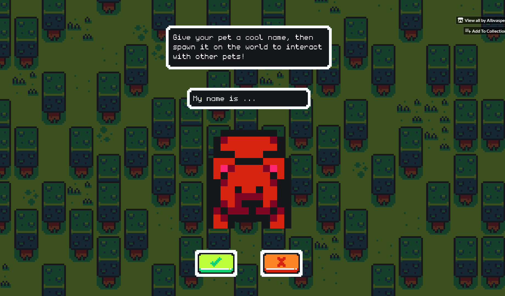

# Pet Ecosystem - Multiplayer Pet Simulation

[](https://unity.com/)
[](https://docs.microsoft.com/en-us/dotnet/csharp/)
[](https://firebase.google.com/)
[](https://docs.unity3d.com/Manual/webgl.html)
[](https://github.com/yourusername/pet-ecosystem)

> **A multiplayer pet ecosystem with Firebase integration, AI behaviors, and real-time synchronization. Features autonomous pet AI with state machines, breeding systems, and viewer interaction through WebGL.**

## Project Overview

Built for WebGL deployment, it features pet AI, Firebase database integration for multi-user interaction, and complex state-driven behaviors. The system maintains stable performance with 20+ autonomous entities interacting simultaneously.

### Core Highlights
- **Custom REST API Wrapper** for Firebase Realtime Database (WebGL-compatible)
- **State Machine Architecture** with inheritance-based pet behaviors
- **Real-Time Queue System** managing viewer connections and spawn requests
- **Autonomous AI Behaviors** including breeding, hunting, and pack dynamics
- **WebGL-Optimized Architecture** with efficient polling and data synchronization

### Stack

| **Category** | **Technology** | **Purpose** |
|--------------|----------------|-------------|
| **Engine** | Unity 6000.0.59f2 LTS | Core game engine |
| **Language** | C# | Unity scripting language |
| **Backend** | Firebase Realtime Database | Multi-user data synchronization |
| **API** | Custom REST Wrapper | WebGL-compatible database operations |
| **AI System** | State Machines | Pet behavior and decision-making |

### Playable Builds

| Version | Link |
|---------|------|
| **Client** | [](https://albvasper.itch.io/pumpets) |
| **Host** | [](https://albvasper.itch.io/pets-ecosystem) |

## Core Systems Architecture

### Firebase REST Integration
```
FirebaseREST
├── GET Operations → Read pet/queue data
├── SET Operations → Update pet states
├── PUSH Operations → Create spawn requests
└── DELETE Operations → Cleanup and removal
```

### Pet Behavior Hierarchy
```
BaseAnimal (Abstract)
├── Pet (Peaceful Animals)
│   ├── Idle State → Wandering/Following pack leader
│   ├── Breeding State → Mate finding and reproduction
│   └── Bumping State → Social interactions
└── HostilePet (Predators)
    ├── Hunting State → Hunting prey
    ├── Attack State → Combat mechanics
    └── Hostil Bumping State → Transitions to hunting state
```

### Spawner Management System
- **Firebase Polling**: Checks spawn requests every 2 seconds
- **Queue Processing**: Handles viewer spawn requests in order
- **Capacity Management**: Enforces 20 pet limit
- **Pet Instantiation**: Spawns prefabs with unique IDs and Firebase registration

## Game Features

### **Pet AI**
- **State-Driven Behaviors**: Clean state transitions with virtual methods
- **Pack Dynamics**: Pets follow pack leaders and coordinate movement
- **Breeding System**: Autonomous mate finding and reproduction
- **Predator-Prey Mechanics**: Hostile pets hunt and consume passive animals
- **Adaptive Responses**: Dynamic behavior based on environment and interactions

### **Multi-User Viewer System**
- **Queue Management**: Automatic queue positioning when ecosystem is full
- **Real-Time Updates**: Live capacity monitoring and position tracking
- **Random Pet Assignment**: Fair distribution of pet types across viewers
- **Spawn Request System**: Asynchronous pet creation via Firebase
- **WebGL Compatible**: Runs in browser without plugins

### **Firebase Integration**
- **Real-Time Synchronization**: All pet data synced across clients
- **Persistent State**: Pet information survives across sessions
- **REST API Operations**: Full CRUD functionality for WebGL
- **Request Polling**: Efficient 2-second interval updates
- **Automatic Cleanup**: Dead pets and completed requests removed


## Key Scripts

| Script | Description |
|--------|-------------|
| [`FirebaseREST.cs`](https://github.com/Albvasper/Pets_Ecosystem/blob/main/Assets/Scripts/Firebase/FirebaseREST.cs) | Custom REST API wrapper for Firebase with GET/SET/PUSH/DELETE operations |
| [`Spawner_Manager.cs`](https://github.com/Albvasper/Pets_Ecosystem/blob/main/Assets/Scripts/Game%20Logic/Spawner_Manager.cs) | Polls Firebase spawn requests and manages pet instantiation |
| [`ViewerScreen_UI_Manager.cs`](https://github.com/Albvasper/Pets_Ecosystem/blob/main/Assets/Scripts/Viewer%20Screen/ViewerScreen_UI_Manager.cs) | Handles viewer queue, capacity checks, and spawn flow |
| [`BaseAnimal.cs`](https://github.com/Albvasper/Pets_Ecosystem/blob/main/Assets/Scripts/Base/Base%20Animal/BaseAnimal.cs) | Core animal class managing health, breeding, and state coordination |
| [`BaseAnimator.cs`](https://github.com/Albvasper/Pets_Ecosystem/blob/main/Assets/Scripts/Base/Base%20Animal/BaseAnimator.cs) | Animation controller base handling sprite animations and transitions |
| [`BaseBehavior.cs`](https://github.com/Albvasper/Pets_Ecosystem/blob/main/Assets/Scripts/Base/Base%20Animal/BaseBehavior.cs) | Behavior management base for movement and state machine execution |
| [`BasePhysics.cs`](https://github.com/Albvasper/Pets_Ecosystem/blob/main/Assets/Scripts/Base/Base%20Animal/BasePhysics.cs) | Physics handling base for collisions and agent interactions |
| [`State.cs`](https://github.com/Albvasper/Pets_Ecosystem/blob/main/Assets/Scripts/Base/State/State.cs) | State machine base class with enter/tick/exit pattern |
| [`Pet.cs`](https://github.com/Albvasper/Pets_Ecosystem/blob/main/Assets/Scripts/Animals/Pets/Pet.cs) | Passive animal implementation extending base animal structure |
| [`HostilePet.cs`](https://github.com/Albvasper/Pets_Ecosystem/blob/main/Assets/Scripts/Animals/Hostile%20Pets/HostilePet.cs) | Predator implementation with hunting and attack behaviors |

## Project Structure
```
Scripts/
├── Animals/
│   ├── Hostile Pets/
│   │   ├── HostilePet.cs               # Predator implementation
│   │   ├── HostilePetAnimator.cs       # Hostile pet animation controller
│   │   ├── HostilePetBehavior.cs       # Behavior management
│   │   ├── HostilePetPhysics.cs        # Physics and collision handling
│   │   └── States/
│   │       ├── State_Attack.cs         # Attack state implementation
│   │       ├── State_Hunt.cs           # Hunting/chase behavior
│   │       └── State_HostileBumping.cs # Hostile collision interactions
│   └── Pets/
│       ├── Pet.cs                      # Passive animal implementation
│       ├── PetAnimator.cs              # Pet animation controller
│       ├── PetBehavior.cs              # Behavior management
│       ├── PetPhysics.cs               # Physics and collision handling
│       ├── AnimalData.cs               # Animal data structure
│       └── States/
│           ├── State_IDLE.cs           # Wandering and pack following
│           ├── State_Breeding.cs       # Mate finding and reproduction
│           └── State_Bumping.cs        # Social collision interactions
├── Base/
│   ├── Base Animal/
│   │   ├── BaseAnimal.cs               # Abstract base class for all animals
│   │   ├── BaseAnimator.cs             # Base animation controller
│   │   ├── BaseBehavior.cs             # Base behavior logic
│   │   └── BasePhysics.cs              # Base physics handling
│   └── State/
│       ├── State.cs                    # Base state class with enter/tick/exit
│       ├── StateTypeAnimal.cs          # Animal-specific state base
│       ├── StateTypePets.cs            # Pet-specific state base
│       └── StateTypeHostilePet.cs      # Hostile pet-specific state base
├── Firebase/
│   ├── FirebaseREST.cs                 # Custom REST API wrapper 
│   └── FirebaseInit.cs                 # Firebase initialization
├── Game Logic/
│   ├── Spawner_Manager.cs              # Firebase polling and pet instantiation
│   ├── Pet_Manager.cs                  # Pet collection and lifecycle management
│   ├── UI_Manager.cs                   # Main ecosystem UI controller
│   ├── Weather_Manager.cs              # Weather system and effects
│   └── Cave.cs                         # Cave shelter mechanics
└── Viewer Screen/
    └── ViewerScreen_UI_Manager.cs      # Viewer UI, queue, and spawn flow
```

## Performance Metrics

- **Firebase Operations**: REST API calls every 2-3 seconds
- **Entity Capacity**: 20 concurrent autonomous pets with AI
- **Framerate**: Stable 144 FPS during peak activity
- **Memory**: Efficient resource management with proper cleanup
- **Response Time**: Real-time spawn request processing (<5s)

## Installation & Setup

### Prerequisites
- Unity 6000.0.59f2 LTS or later
- Firebase Realtime Database account
- Visual Studio 2019/2022 or VS Code
- Git for version control

### Quick Start
```bash
# Clone the repository
git clone https://github.com/Albvasper/Pets_Ecosystem.git

# Open in Unity
# File → Open Project → Select the cloned folder

# Configure Firebase
# 1. Create a Firebase Realtime Database
# 2. Set database URL in FirebaseREST component
# 3. Configure database rules for read/write access

# Play in Editor
# Open EcosystemScene and ViewerScene
# Press Play on both scenes
```

## Screenshots





## Contact

**Alberto Vásquez** - Game Programmer  
https://codebyalberto.framer.website/
